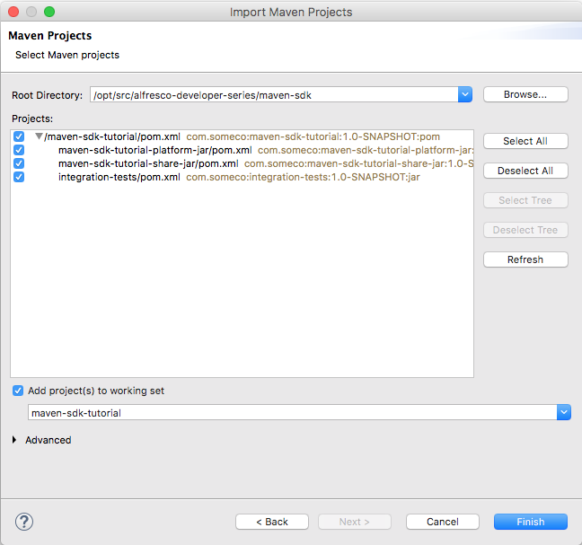
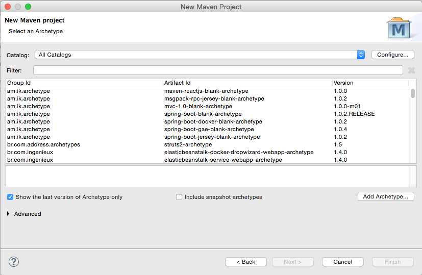
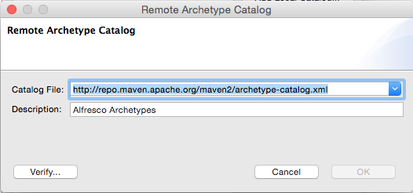
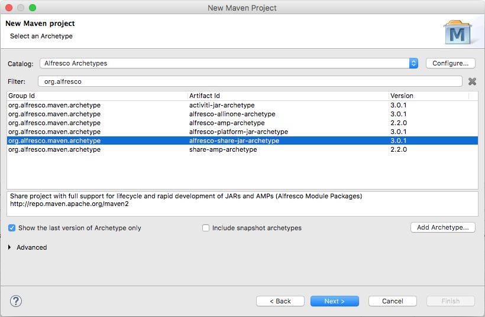
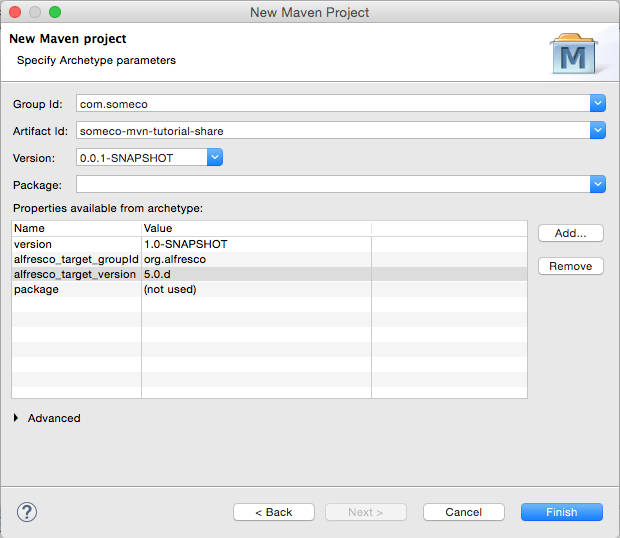

% Getting Started with the Alfresco Maven SDK
% Jeff Potts, [Metaversant Group](https://www.metaversant.com)
% February, 2019

License
=======


This work is licensed under the Creative Commons Attribution-ShareAlike 3.0 Unported License. To view a copy of this license, visit http://creativecommons.org/licenses/by-sa/3.0/ or send a letter to Creative Commons, 444 Castro Street, Suite 900, Mountain View, California, 94041, USA.

Introduction
============
This tutorial is for people who have been handed a project that requires you to
customize Alfresco in some way and you're thinking, "Now what?". By the end,
you'll know:

* How to create a new Alfresco project using the Alfresco Maven SDK
* What goes where depending on the type of customization you are doing
* How to create and run tests
* How to produce an artifact suitable for deploying to your environment or
sharing with the community.

This tutorial should be considered a pre-requisite before moving on to more
detailed tutorials on things like content modeling, custom actions, behaviors,
advanced workflows, or web scripts.

Before we jump in, a quick disclaimer: There are almost always multiple routes
to a given solution. In this tutorial, I'm going to take you through the most
direct, safest route that will get you up-and-going quickly. Later, if you
decide you want to change things up or explore other paths, that's great.

Important Concepts
==================
You don't need to know much about Maven, Alfresco, or why this SDK exists before
jumping in but it kind of helps set the scene, so let me take you through those
three concepts quickly.

Apache Maven
------------

[Apache Maven](http://maven.apache.org/) is essentially a build management tool.
It has many features, but the primary time-saving feature is its ability to
understand the dependencies your project relies on (and the dependencies of
those dependencies and so on). Maven can then retrieve and cache those
dependencies for you. If you've ever spent time chasing down JAR file after
JAR file, the value of such a tool will be immediately obvious.

Alfresco Module Package (AMP)
-----------------------------

An AMP is a ZIP file with a folder structure that follows a specific convention.
AMP files are used to make it easy to share and deploy customizations to the
Alfresco platform. If your project is about making customizations to the
repository tier (the /alfresco web application) you will create a "repo" AMP.
If your project is about making customizations to the Share tier (the /share web
application) you will create a "share" AMP. It is quite common for a project
to require changes in both tiers, so in that case you will create two AMPs.

Alfresco Maven SDK
------------------

The goal of the Maven-based SDK is to make it extremely easy for you to get
started with Alfresco development. It consists of a project template (an
  "archetype" in Maven parlance) and some built-in smarts that make Maven
  understand how to create AMPs and deploy them to Alfresco.

If you are writing your own custom application that is separate from the
Alfresco and Share WARs you don't need the Alfresco Maven SDK. But if you intend
to write code that runs within either of those web applications, the Alfresco
Maven SDK is where you need to start.

A quick word about versions. This tutorial assumes you are using Alfresco Maven
SDK 4.0 which works with Alfresco 6.0.1 and higher. If you are using a version
of Alfresco older than 6.0.1 but greater than or equal to 4.2.7, you can use
version 3.0.1 of the SDK. The biggest difference between 4.0 and 3.0.1 is the
use of Docker instead of an embedded Tomcat and in-memory database.

If you are using a version of Alfresco newer than 4.0 but older than 4.2.7 you
can use version 2.x of the SDK. You can use the 2.x version of the SDK with this
and other tutorials if you must, but you'll almost surely be affected by some
differences. If you are using a version of Alfresco older than 4.x you'll have
to use the old Ant-based SDK. The rest of this document won't apply to you.

Now you have a high-level understanding of Apache Maven, AMPs, and the Alfresco
Maven SDK. It's time to see them in action.

Your First Project
==================
Let me show you how easy it can be to get started with Alfresco development
using the Alfresco Maven SDK. Before I start I'm going to assume you have the
following installed:

* Java 1.8.0_201
* Apache Maven 3.3.9
* Alfresco Maven SDK 4.0 (No download necessary)
* Docker 18.09.2
* Docker Compose 1.23.2

You don't need to download anything else. Seriously. Not even Alfresco.

Here are the steps:

1. Create an empty directory. It doesn't matter where it is or what you call
it. I'll refer to it as $TUTORIAL_HOME. We're going to be creating some
additional directories in here shortly.

2. Now let's create a new project. For now, let's assume you want to create
something that you will deploy to the Alfresco repository tier such as a custom
content model, some custom rule actions, a new set of web scripts, or some
Activiti business processes. It doesn't really matter. To create the new
project, change directories to $TUTORIAL_HOME, then run this command:

    ```   
    mvn archetype:generate -Dfilter=org.alfresco:
    ```

3. Maven will do some work and eventually ask you to choose an "archetype".
You're basically selecting from a library of template projects. There are
several available:

        1: remote -> org.alfresco.maven.archetype:activiti-jar-archetype
        2: remote -> org.alfresco.maven.archetype:alfresco-allinone-archetype
        3: remote -> org.alfresco.maven.archetype:alfresco-amp-archetype
        4: remote -> org.alfresco.maven.archetype:alfresco-platform-jar-archetype
        5: remote -> org.alfresco.maven.archetype:alfresco-share-jar-archetype
        6: remote -> org.alfresco.maven.archetype:share-amp-archetype

    Even though our goal is to create an AMP that can be deployed to Alfresco,
    neither of the two options with "amp" in their names are what we want. Those
    are for old versions of the SDK. Instead, we want to choose
    "alfresco-allinone-archetype" so type the number that matches that archetype
    (2 in this example) and hit enter.

4. If Maven asks you to specify the version of the archetype you want, choose
4.0.

5. Maven now asks for a groupId. You should be thinking "Java package". My
examples always assume I am working at a fictitious company called SomeCo,
so I will specify "com.someco" here. Specify what makes sense in your case and
hit enter.

6. Next is the artifactId. You can think of this as what you want your project
to be called. It will also be used as part of the ID for your AMPs so make it
something unique. I'm going to specify "maven-sdk-tutorial" for mine followed
by enter.

7. Take the default package, which will match your groupId.

8. At this point Maven will show you the values you entered plus some others
that were defaulted and ask you to confirm your choices. If you want to change
something you can specify "N" and then make changes or you can enter "Y" to
continue. You can always change these values later if needed, so specify "Y"
followed by enter.

Now Maven is going to do some work. When it is done you will have:

* A project structure organized exactly how it needs to be to support your
Alfresco development
* Default configuration files
* Minimal Java code and accompanying unit and integration tests just to verify
that everything works
* Configuration required to run a local instance of Alfresco suitable for
testing
* A default POM (Project Object Model) XML file that tells Maven what your
project depends on

The SDK defaults to a fairly recent Alfresco version. If you need to run on a
different version, you might want to edit maven-sdk-tutorial/pom.xml and change
it before you proceed.

Let's Run It
------------

You haven't downloaded anything. You haven't edited anything. All you've done is
tell Maven to create a project based on a template. But the cool thing is this:
Your project is runnable right now.

Try this:

    cd maven-sdk-tutorial
    ./run.sh build_start

If you get a permissions error, run `chmod u+x ./run.sh` and try again. If you
are on Windows, use run.bat instead.

If you watch the output, you'll see that Maven is downloading everything it
needs to compile the project, creating an AMP, downloading Docker images from
Docker Hub, deploying the AMP to the Alfresco WAR, defining an Alfresco Content
Services Docker image, deploying the Share AMP to the Share WAR, defining an
Alfresco Share Docker image, and using Docker Compose to start up Alfresco,
Share, PostgreSQL, and Alfresco Search Services. Eventually you'll see:

    2018-04-13 13:23:07,796  INFO  [repo.module.ModuleServiceImpl] [localhost-startStop-1] Found 3 module package(s).
    2018-04-13 13:23:07,807  INFO  [repo.module.ModuleServiceImpl] [localhost-startStop-1] Installing module 'maven-sdk-tutorial-platform-jar' version 1.0-SNAPSHOT.
    DemoComponent has been executed

Which means that the module your project generated was recognized by the
Alfresco server.

Once you see:

    INFO: Starting ProtocolHandler ["http-bio-8080"]

You should be able to go to:

    http://localhost:8080/alfresco

And you will see the "Welcome to Alfresco' page. If you want to verify that you
can log in, go to the Alfresco web script console, which is:

    http://localhost:8080/alfresco/s/index

Log in using "admin" and "admin" to see the list of deployed web scripts.

Because you chose to base your project off of the "all-in-one" archetype, not
only did you get the Alfresco WAR with your sample AMP deployed, but also the
Share WAR is up-and-running. That means you can go to:

    http://localhost:8180/Share

And log in to navigate the repository, leverage the admin console, and so on.

When you are done poking around, go back to the window where you ran your Maven
command and type ctrl-c to stop tailing the logs. Then, do `run.sh stop` to
shutdown all of the Docker containers.

What Just Happened?
-------------------
If you look at the run script, you'll see that "build_start" cleans the project
output, builds the Alfresco and Share extensions, sets up Docker named volumes,
then tells Docker Compose to bring up the Docker containers.

The Docker Compose file lives in the Docker directory in the root of the
project.

Once it started up, you were able to log in to both the repository tier admin
console and web scripts console running in the Alfresco WAR as well as Share
running in the Share WAR.

If you go look in the target directory under "maven-sdk-tutorial-platform-jar"
you'll see a JAR file called "maven-sdk-tutorial-platform-jar-1.0-SNAPSHOT.jar"
that was produced by the build and subsequently deployed to the Alfresco WAR.

Similarly, in the target directory under "maven-sdk-tutorial-share-jar" you'll
see that the build also created a "Share tier" JAR called
"maven-sdk-tutorial-share-jar-1.0-SNAPSHOT.jar".

If you do a `docker ps -a|grep maven` you'll see the list of Docker containers
that the SDK generated for you.

JARs versus AMPs
----------------
You can deploy Alfresco projects as JAR files only in a limited number of very
simple cases. More often, your changes will need to be packaged as an Alfresco
Module Package (AMP) file. Because AMPs must still be used most of the time, it
simplifies things to use AMPs all of the time and to never use JARs. So, it's a
good idea to just get in the mindset that you've just built your last Alfresco
modules as JAR files and from now on it will be all AMPs, all the time.

To change your project to produce AMPs, edit the pom.xml. Search for the
"maven-assembly-plugin" and uncomment it. Now when you run
`mvn install -DskipTests` you'll see that an AMP gets produced in the platform
and share target directories.

These AMP files are what you would give to your IT team if you were ready to
deploy your project to a real Alfresco server.

Other Commands for Invoking the Build
-------------------------------------
You may not always need to start up the Alfresco server and leave it running.
If you just want to build the project, run the unit tests, and package the AMP,
you can run:

    mvn package

If you want to install the AMP into your local Maven repository you can run:

    mvn install -DskipTests

In 3.0.1 you may see some stack traces after running `mvn install`. If you
scroll up a bit, you'll see that the tests ran successfully. The stack traces
are a known issue related to Tomcat shutdown hooks and can safely be ignored.

In 4.0, the containers need to be running before executing the tests. We'll
cover that in the next section.

Unit & Integration Tests
------------------------
You may have noticed that the default project includes a simple unit test in the
platform-jar module and some integration tests in the integration-tests module.
By default, Maven will automatically run the unit tests and integration tests in
your project unless you include `-DskipTests`.

It's a good practice to make sure that your project always includes unit tests
and to run them every time you build. Many organizations run CI (Continuous
Integration) tools that depend on this being the case. Running `mvn test` will
compile and run the project's unit tests.

To run integration tests using SDK 4.0, first start up the server using
`run.sh build_start`. Once it is running, do `run.sh test` to run the
integration tests. You'll see something like:

    -------------------------------------------------------
     T E S T S
    -------------------------------------------------------
    Running com.someco.platformsample.DemoComponentIT
    Tests run: 2, Failures: 0, Errors: 0, Skipped: 0, Time elapsed: 0.443 sec - in com.someco.platformsample.DemoComponentIT
    Running com.someco.platformsample.CustomContentModelIT
    Tests run: 2, Failures: 0, Errors: 0, Skipped: 0, Time elapsed: 0.113 sec - in com.someco.platformsample.CustomContentModelIT
    Running com.someco.platformsample.HelloWorldWebScriptIT
    Tests run: 1, Failures: 0, Errors: 0, Skipped: 0, Time elapsed: 0.036 sec - in com.someco.platformsample.HelloWorldWebScriptIT

    Results :

    Tests run: 5, Failures: 0, Errors: 0, Skipped: 0

When creating your own tests, remember that Unit Tests will not depend on any
other services, including a running repository, whereas Integration Tests
require the Docker containers to be running before they can be executed.

You can greatly speed up your test-fix cycle by using something like JRebel.
With JRebel, after you launch the Docker containers, you can make changes to
your integration test classes, hot-deploy them to the running server, then
re-run your tests, all without having to restart.

Logging
-------
In the log4j.properties file that exists in the module directory, the
log4j.properties file includes

    log4j.logger.org.alfresco.demoamp.DemoComponent=${module.log.level}

You'll probably want to replace that with settings that match your package
structure.

Cleaning Up
-----------
If you want to delete all of the compiled artifacts that Maven created and start
fresh you can run:

    mvn clean

If you also want to delete the Docker containers and volumes that were created
by running the test Alfresco server, you can run `./run.sh purge`.

Now you know how to create a new Alfresco project from an archetype and the
fundamentals of running builds with and without tests. Next up, you'll learn
about working with your new project in an IDE and you'll get a tour of the
default project structure.

Working With Your Project in an IDE
-----------------------------------
Although it isn't required, most people prefer to work in an IDE when developing
Alfresco customizations. Any IDE will do, but my favorite is IntelliJ IDEA. Its
Maven support seems to be more seamless than what is currently in Eclipse.
IntelliJ users can just open or import the project and go.

Another popular choice is Eclipse. It has Maven support, but it may be less
obvious how to work with your Alfresco project, so let's see how that works.

I'll be using the Neon version of Eclipse Java EE IDE for Web Developers.

To open the project we created earlier in Eclipse, do this:

1. Select File, Import, Maven, Existing Maven Projects. Click Next.

    

2. Specify the directory that contains the maven-sdk-tutorial folder. Eclipse
will inspect that folder and show your project in the projects list. Make sure
the checkbox next to the project name is checked, then click Next.

    

After clicking Finish, the project is imported into your Eclipse workspace.

Note: In Eclipse you may see Maven lifecycle related errors after importing a
project based on the Alfresco Maven SDK. You can modify your pom.xml to resolve
these errors or they can be ignored. IntelliJ should have no problem.

Understanding the Project Structure
-----------------------------------
The folder structure of your project is a bit more pleasant to explore in your
IDE. Let's see what we've got.

When you created the project from the all-in-one archetype, you ended up with a
project called "maven-sdk-tutorial" that has five modules:

1. maven-sdk-tutorial-platform-jar: This is the module that holds your
"repository tier" customizations and produces an AMP that gets installed into
the Alfresco WAR.
2. maven-sdk-tutorial-share-jar: This is the module that holds your "Share tier"
customizations and produces an AMP that gets installed in the Share WAR.
3. integration-tests: This module is for integration tests that run in the
embedded Tomcat server.
4. maven-sdk-tutorial-platform-docker: This is the module that defines an
Alfresco Content Services Docker image specific to your project. It is based on
the Alfresco packaged Docker image and adds your platform extension.
5. maven-sdk-tutorial-share-docker: This is the module that defines an Alfresco
Share Docker image specific to your project. It is based on the Alfresco
packaged Docker image and adds your Share extension.

Inside the project directory, you'll see:

* *pom.xml* In the root of the project directory you'll see pom.xml. This tells
Maven everything it needs to know about your project. Remember those settings
you specified when you created the project from the archetype? You can make
changes to those settings here. For example, version 4.0 of the archetype
assumes you are working with Alfresco Community Edition 6.0.7. If you wanted to
work with a different version, you would simply change those properties and then
tell Maven to update and it will take care of the rest.

Now look at "maven-sdk-tutorial-platform-jar". In it, you'll find:

* *src/main/java* This is where you should create your own packages to organize
your Java code. Things like custom action executer classes, custom behaviors,
Java-based controllers for web scripts go here. If you don't know what those
are, don't worry, there are tutorials available [here](https://ecmarchitect.com/alfresco-developer-series).
These files will ultimately be placed in a JAR. When the AMP is installed into
the Alfresco WAR, the JAR will be placed under WEB-INF/lib.

* *src/test* Everything under src/test is about running unit tests. The unit
tests themselves go in src/test/java. Any resources those classes need go in
src/test/resources. In src/test/properties/local you'll see an
alfresco-global.properties file. If you are already know something about
Alfresco you know that this is used to configure Alfresco. In this case, it is
only used when running the embedded Alfresco server for testing purposes.

* *src/main/assembly* Everything in this directory tells Maven how to construct
an AMP file.

* *src/main/resources* Everything else goes somewhere in this part of the
project. The structure of an AMP is well-documented so I don't want to duplicate
that here. Let me just point out the highlights:

    * The alfresco/module/maven-sdk-tutorial-platform-jar directory is the heart
    of the AMP. This is where you place Spring config XML files, content model
    XML files, and user interface configuration. As you'll see in later
    tutorials, I prefer separate sub-directories for each of these things.
    * If your module includes web scripts, those don't reside under the module
    directory. Instead, those go under alfresco/extension/templates/webscripts.
    * Your module may include client-side resources that need to be deployed to
    the root of the web application. Those go in META-INF/resources in
    directories such as css, jsp, scripts, and images.

Going back up a level, take a look at "maven-sdk-tutorial-share-jar". It has a
similar structure as the platform-jar module, but instead of an "extension"
directory under "src/main/resources/alfresco", a Share project has a
"web-extension" directory where you'll find Share-specific directories like
"site-data" and "site-webscripts".

If you are already familiar with Share customizations, you may be wondering
where to find "share-config-custom.xml". It is in "src/main/resources/META-INF".

You should check this entire project, starting with the "maven-sdk-tutorial"
directory, into source code control. You will want to configure your source code
control client to ignore the target directories. If you are running IntelliJ,
check in the IML files but do not check in the .idea directory or its children.

Other Types of Archetypes
=========================
In this and subsequent tutorials I am using the "all-in-one" archetype because
most of these tutorials need to produce both a repository tier AMP and a Share
tier AMP. It is often convenient to do that in a single project.

If you know you are going to create only one or the other, you can specify a
different archetype. When generating your project from an archetype, choose
"alfresco-platform-jar-archetype" to create a project that will produce only a
repository tier AMP. Choose "share-amp-archetype" to create a project that will
produce only a Share tier AMP.

The nice thing about using one of these tier-specific archetypes is that it is a
smaller, more simplified project structure. One downside is that these projects
lack the "integration-tests" module. You can add it, but it won't be there
initially.

Even when developing both a repository tier AMP and a Share tier AMP, some
developers like having two independent projects that can be versioned
independently.

Creating Projects from Within Eclipse
=====================================
In the previous section, you created a new Alfresco project from the command
line using the all-in-one archetype. Rather than use the command line, another
option is to configure Eclipse so you can create new Alfresco projects using the
Alfresco Maven SDK without leaving the IDE.

Let's create a new project. But this time, we'll do it from Eclipse instead of
the command line, and we'll use the Share archetype instead of all-in-one.

1. File, New Maven Project.
2. Specify $TUTORIAL_HOME, then click next.

    

3. Click Configure so we can add Alfresco's catalog to the list.

    

4. Click Add Remote Catalog
5. Specify "https://nexus.alfresco.com/nexus/content/groups/public/archetype-catalog.xml"
as the Catalog File. Specify "Alfresco Archetypes" as the description. Then,
click OK and OK again to close the Preferences panel.

    

6. Now select "Alfresco Archetypes" in the catalog and you'll see a bunch of
archetypes show up in the list.
7. Specify "org.alfresco.maven.archetype" in the filter and you'll see the same
archetypes that were presented to you as options on the command line at the
start of the tutorial.
8. Select the alfresco-share-jar-archetype and click Next.

    

9. Specify "com.someco" for the groupId and "maven-sdk-tutorial-share" as the
artifactId, then click Finish.

    

Now your new customization project is in your workspace. The next time you
create a project using the archetype, it will be a few less steps because you
won't have to add the catalog.

Other Topics to Explore on Your Own
===================================
You now know how to use the Alfresco Maven SDK to create projects for both your
Alfresco repository customizations and your Alfresco Share customizations. If
you are new to Alfresco development, I hope you agree it is really easy to
bootstrap a project to get started.

There are many topics that weren't covered in this tutorial. I'll leave you to
explore those on your own. Here are a few:

* The Alfresco Maven SDK supports both Community Edition and Enterprise
Edition. If you need help accessing the Enterprise Edition artifacts, contact
Alfresco Support.
* The SDK can pull in other AMPs that your project might depend on so that when
the embedded Tomcat server runs you'll have everything you need for integration
testing. You'll see examples of this in later tutorials.

Where to Find More Information
==============================
- The [official documentation](https://docs.alfresco.com/5.2/concepts/sdk-intro.html)
on the Alfresco Maven SDK is on <https://docs.alfresco.com>.
- The [Alfresco Developer Series](https://ecmarchitect.com/alfresco-developer-series)
on [ECM Architect](https://ecmarchitect.com) has free tutorials on custom
content models, actions, behaviors, workflows, and web scripts.
